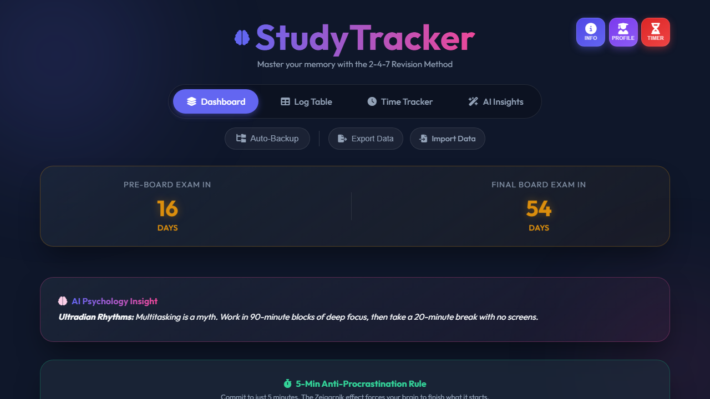

<div align="center">

# 🧠 StudyTracker

### Master Your Memory with the **2-4-7 Spaced Repetition Method**

[](https://susant07-star.github.io/StudyTracker/)
[](LICENSE)
[](#)
[](#)
[](#)

A personal academic productivity web app that helps students study smarter — combining **spaced repetition**, **time logging**, and **AI-powered coaching** in one beautiful, offline-capable interface.

</div>

---

## ✨ Features

| Feature | Description |
|---|---|
| 🧠 **2-4-7 Spaced Repetition** | Auto-schedules revision reminders at 2, 4, and 7 days after first study |
| ⏱️ **Time Tracker** | Log every study session with subject, start/end time, and notes |
| 🤖 **AI Insights** | Daily, weekly, and monthly mentor-level feedback via Groq AI |
| 📊 **Progress Charts** | Visual breakdown of study hours, subject distribution, peak hours & revision rate |
| 🍅 **Pomodoro Timer** | Built-in focus timer with customizable focus, short break, and long break modes |
| 🎯 **Exam Countdown** | Set up to 2 upcoming exam dates and see a live countdown on the dashboard |
| 🔥 **Study Streaks** | Daily streak tracking to keep you consistent and accountable |
| 👤 **Student Profiles** | Configure your grade, faculty, and subjects — app auto-fills relevant subjects |
| 💾 **Auto Backup** | Link a local folder and your data auto-saves — never lose your progress |
| 📤 **Export / Import** | Download your data as JSON or restore from a backup file at any time |
| 🔒 **100% Private** | All data stored locally on your device. No account, no cloud, no tracking |

---

## 🖥️ Screenshots



---

## 🚀 Live Demo

👉 **[Open StudyTracker →](https://susant07-star.github.io/StudyTracker/)**

No installation needed. Works directly in your browser.

---

## 🛠️ Tech Stack

- **Frontend:** HTML5, CSS3, Vanilla JavaScript
- **Charts:** [Chart.js](https://www.chartjs.org/) v4.4
- **Icons:** [Font Awesome](https://fontawesome.com/) v6.4
- **Fonts:** [Outfit](https://fonts.google.com/specimen/Outfit) — Google Fonts
- **AI:** [Groq API](https://console.groq.com/) (free tier — user provides their own key)
- **Storage:** `localStorage` (fully offline capable)
- **Hosting:** GitHub Pages

---

## 📖 How to Use

**1. Set Up Your Profile**
> Tap the **Profile** icon → Choose your grade & faculty → Subjects auto-fill. Add exam dates for a live countdown timer.

**2. Log What You Study**
> On the **Dashboard**, add a session with the subject, chapter/topic, and date. The app auto-schedules revision reminders at 2, 4, and 7 days.

**3. Do Your Daily Revisions**
> Check the **Due Today** panel each morning. Green ✅ = done. Orange ⏳ = revision due. Red 🔴 = overdue!

**4. Track Your Hours**
> Go to **Time Tracker** and log each activity with a start time, end time, and subject. This feeds all the analytics charts.

**5. Get AI Feedback**
> Visit **AI Insights**, paste your free [Groq API key](https://console.groq.com/keys), and generate a daily/weekly/monthly mentor analysis.

**6. Backup Your Data**
> Use the **Auto-Backup** button to link a local folder — data saves automatically in the background.

---

## 🏃 Run Locally

No build step required. Just open the file in any modern browser:

```bash
# Clone the repository
git clone https://github.com/Susant07-star/StudyTracker.git

# Navigate into the folder
cd StudyTracker

# Open in browser (double-click or use a local server)
# With VS Code Live Server:
# Right-click index.html → Open with Live Server
```

---

## 🤖 AI Setup (Optional)

StudyTracker uses the **Groq API** for AI-powered insights. It's completely free:

1. Go to [console.groq.com/keys](https://console.groq.com/keys) and sign up for free
2. Create an API key
3. Open **AI Insights** tab in StudyTracker
4. Paste your key and click **Save**
5. Click **Generate AI Insights** 🎉

> Your API key is stored **only in your browser** and never sent anywhere else.

---

## 📁 Project Structure

```
StudyTracker/
├── index.html        # Main app — all views (Dashboard, Time Tracker, AI Insights)
├── style.css         # All styles — glassmorphism dark UI
├── script.js         # All logic — data management, charts, AI calls
├── favicon.ico       # App icon
├── logo.png          # App logo
└── README.md         # You are here
```

---

## 🗺️ Roadmap

- [ ] PWA support (installable as an app on Android/iOS)
- [ ] Multiple profile support (for families or shared devices)
- [ ] Weekly planner / goal-setting module
- [ ] Cloud sync option (optional, user-controlled)
- [ ] More AI models support (Gemini, OpenAI)

---

## 📄 License

This project is licensed under the **MIT License** — see the [LICENSE](LICENSE) file for details.

---

<div align="center">

Built with ❤️ for students everywhere

**[⭐ Star this repo](https://github.com/Susant07-star/StudyTracker)** if StudyTracker helped you study smarter!

</div>
