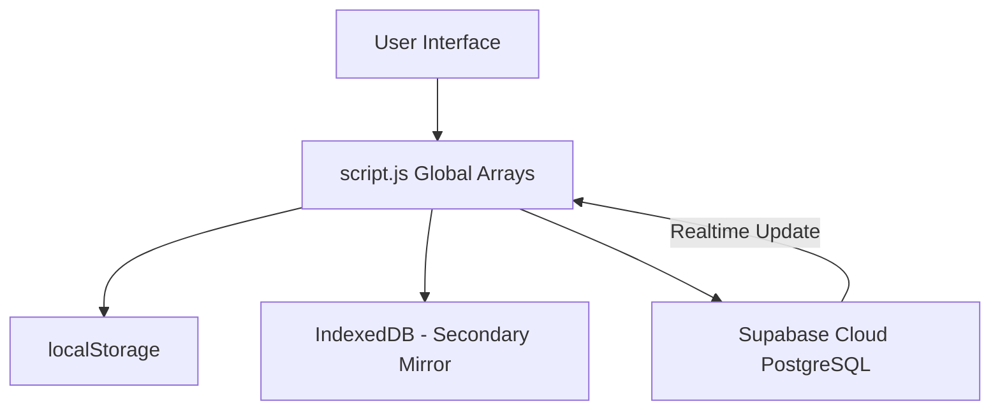
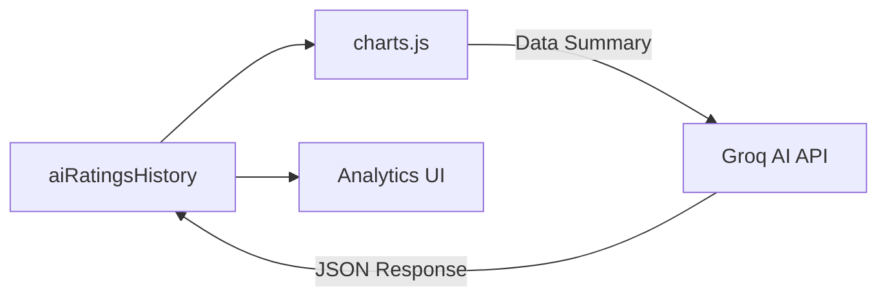

# 🌊 Data Flow

## 1. Overview
HourForge operates on an **Offline-First** data flow. User actions (Start study, stop timer, log activity) are reflected immediately in the UI using local data, then asynchronously mirrored to persistent browser storage and the cloud.

## 2. Theoretical Data Loop
The flow follows a "Circle of Persistence" to ensure no data loss:

## 3. Detailed Data Movement

### Phase 1: Input & Mutation
- **User Action**: The student stops the Study Timer.
- **`script.js`**: 
  - Generates a `crypto.randomUUID()` for the `id`.
  - Stamps the `updated_at` field with `Date.now()`.
  - Pushes the new `StudySession` object to the global `studySessions` array.

### Phase 2: Local Persistence
- **Trigger**: Any data mutation calls `saveToLocal()`.
- **`localStorage`**: Stores the serialized JSON representation of the entire array for nearly instant retrieval on page reload.
- **`IndexedDB`**: Mirrored copy is updated (for larger data objects or backups).

### Phase 3: Cloud Synchronization
- **Trigger**: `uploadDataToCloud()` is called (debounced or on mutation).
- **Supabase**: 
  - `upsert` call is made against the `user_data` table.
  - Conflict resolution is handled via `onConflict: 'user_id'`.
- **Merge**: If the user has multiple devices, the "Deep Merge" strategy reconciles incoming cloud data with local data.

## 4. Analytical Data Flow
For the "Insights" and "Charts" features, data follows a slightly different pathway:

## 5. Summary Table

| Action | Source -> Destination | Speed | Reliability |
| :--- | :--- | :--- | :--- |
| **Study Timer Stop** | UI -> `script.js` | Instant | 100% (In-Memory) |
| **Save Session** | `script.js` -> `localStorage` | ~10ms | 99% (Browser Dependent) |
| **Cloud Sync** | `script.js` -> Supabase | ~500ms - 2s | Dependent on Network |
| **AI Insights** | `charts.js` -> Groq Cloud | ~800ms - 1.5s | Dependent on API Key |

---
*Data reliability is maintained through the "Latest Write Wins" philosophy using the `updated_at` timestamp.*
