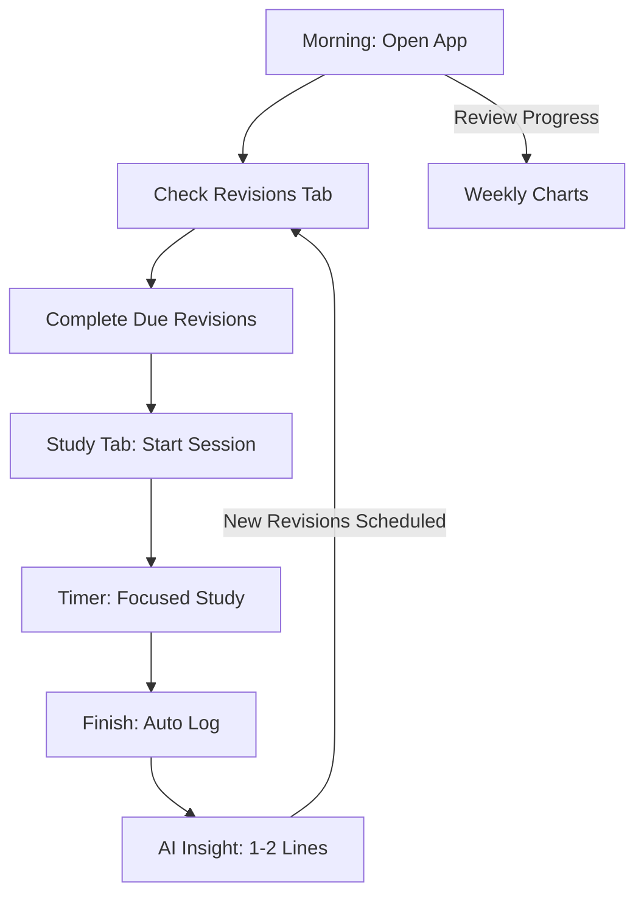

# 🧭 UX Flows

## 1. The Daily Usage Loop (The Hero Journey)
The app is designed to be the first thing a student opens in the morning and the last thing they close at night.

## 2. Study Session Flow (New v3.0+)
Goal: **Zero-Friction Tracking.**

1. **Trigger**: Student decides to study.
2. **Setup**: Selects pre-filled Subject (e.g., Physics) and enters Topic.
3. **Start**: Taps "Start" (Screen dims, timer starts, distracting AI elements disappear).
4. **Active Study**: App shows live duration and an "Anti-Procrastination" secondary timer if they feel stuck.
5. **Completion**: Taps "Stop." 
6. **Result**: Data is persisted (`study_sessions`), revisions are scheduled (`revision_tasks`), and short AI feedback is shown.

## 3. Revision Flow (2-4-7 Rule)
Goal: **Long-Term Retention.**

1. **Notification**: The "Revisions" tab icon shows a badge (e.g., "5").
2. **Review**: Student opens the tab and sees cards for "Due Today."
3. **Action**: They tap a card to "Start Revision."
4. **Validation**: Unlike the Study flow, the student simply confirms they've reviewed the material.
5. **Completion**: Taps "Done." The card moves to "Completed," and the next revision (e.g., Day 4 or Day 7) is activated.

## 4. Onboarding Flow (First-Time User)
Goal: **Instant Personalization.**

1. **Step 1**: Choose Faculty (Science, Management, Law, etc.).
2. **Step 2**: The app auto-populates the default "Subjects" list.
3. **Step 3**: Set Exam Dates (Start the countdown).
4. **Step 4**: Enter Groq API Key (The "Intelligence" setup).

## 5. Feedback Loop
After every action, the student receives immediate visual or textual feedback:
- **Positive**: "Streak Extended! 🔥"
- **Critical**: "Subject Neglected! ⚠️" (AI Coach).
- **Gamified**: Progress charts updating in real-time.

---
*UX flows should feel like a "Conversation" between the student's goals and the app's reminders.*
