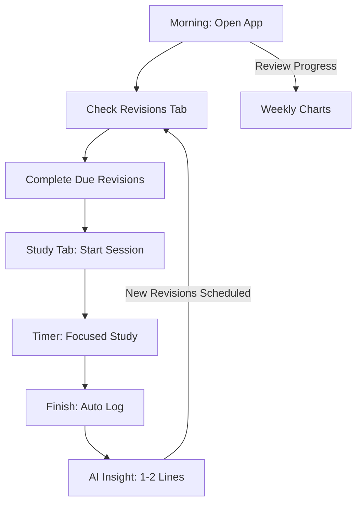

# 🧭 UX Flows

## 1. The Daily Usage Loop (The Hero Journey)
The app is designed to be the first thing a student opens in the morning and the last thing they close at night.

## 2. Study Session Flow (New v3.0+)
Goal: **Zero-Friction Tracking.**

1. **Trigger**: Student decides to study.
2. **Setup**: Selects pre-filled Subject (e.g., Physics) and enters Topic.
3. **Start**: Taps "Start" (Screen dims, timer starts, distracting AI elements disappear).
4. **Active Study**: App shows live duration and an "Anti-Procrastination" secondary timer if they feel stuck.
5. **Completion**: Taps "Stop."
6. **Result**: Data is persisted (`study_sessions`), revisions are scheduled (`revision_tasks`), and short AI feedback is shown.

## 3. Revision Flow (2-4-7 Rule)
Goal: **Long-Term Retention.**

1. **Notification**: The "Revisions" tab icon shows a badge (e.g., "5").
2. **Review**: Student opens the tab and sees cards for "Due Today."
3. **Action**: They tap a card to "Start Revision."
4. **Validation**: Unlike the Study flow, the student simply confirms they've reviewed the material.
5. **Completion**: Taps "Done." The card moves to "Completed," and the next revision (e.g., Day 4 or Day 7) is activated.

## 4. Pomodoro Fullscreen Flow (v2.2+)
Goal: **Distraction-Free Deep Focus.**

1. **Setup**: User opens the **Pomodoro tab**, edits Focus/Break/Duration settings if needed.
2. **Enter Fullscreen**: Taps the "Enter Full Screen" pill button beneath Timer Settings.
3. **Full Screen Active**: All UI chrome (header, nav bar, settings, mode selector) disappears. Only the SVG ring and time display remain, perfectly centered.
4. **Controls**: Controls bar is initially visible for 3 seconds, then fades out automatically.
5. **Tap to Toggle**: Tapping anywhere on the screen instantly toggles the floating controls bar.
6. **Auto-Advance**: When Focus ends → timer auto-transitions to Break (and vice versa). The background color shifts from red → green to signal the mode change.
7. **Exit**: Tap the `⛶` (compress) button on the right side of the controls bar, or press `Esc`.
8. **Note**: Horizontal swipe-to-change-tab is disabled while in fullscreen to prevent accidental tab changes.

## 5. Onboarding Flow (First-Time User)
Goal: **Instant Personalization.**

1. **Step 1**: Choose Faculty (Science, Management, Law, etc.).
2. **Step 2**: The app auto-populates the default "Subjects" list.
3. **Step 3**: Set Exam Dates (Start the countdown).
4. **Step 4**: Enter Groq API Key (The "Intelligence" setup).

## 6. Feedback Loop
After every action, the student receives immediate visual or textual feedback:
- **Positive**: "Streak Extended! 🔥"
- **Critical**: "Subject Neglected! ⚠️" (AI Coach).
- **Gamified**: Progress charts updating in real-time.

## 7. Premium SaaS UI Design System (v2.3.0+)
Goal: **Consistent, high-quality visual language across all views.**

The app follows a strict component-based design system defined in `src/input.css`:

| Token | Usage |
|---|---|
| `.premium-card` | All content containers — `rounded-2xl`, `bg-slate-900`, `shadow-lg`, `border border-white/5` |
| `.premium-input` | All text/select/date/number inputs — consistent padding, border, focus ring |
| `.premium-btn-primary` | Primary CTA buttons — indigo fill, glow shadow |
| `.premium-btn-secondary` | Secondary/ghost buttons — opaque border, subtle hover state |
| `.premium-heading` | Page-level headings — `text-2xl font-black tracking-tight` |
| `.premium-subtext` | Descriptive subtitles — `text-sm text-slate-400` |

**Layout Rules:**
- `gap-6` is the standard spacing unit between cards and sections.
- No raw `margin` or `padding` for inter-section spacing — use `gap` in flex/grid.
- All interactive elements must have `hover:` and `transition-all` feedback.
- Modal overlays use glassmorphism: `bg-slate-900/95 backdrop-blur-xl`.

---
*UX flows should feel like a "Conversation" between the student's goals and the app's reminders.*
